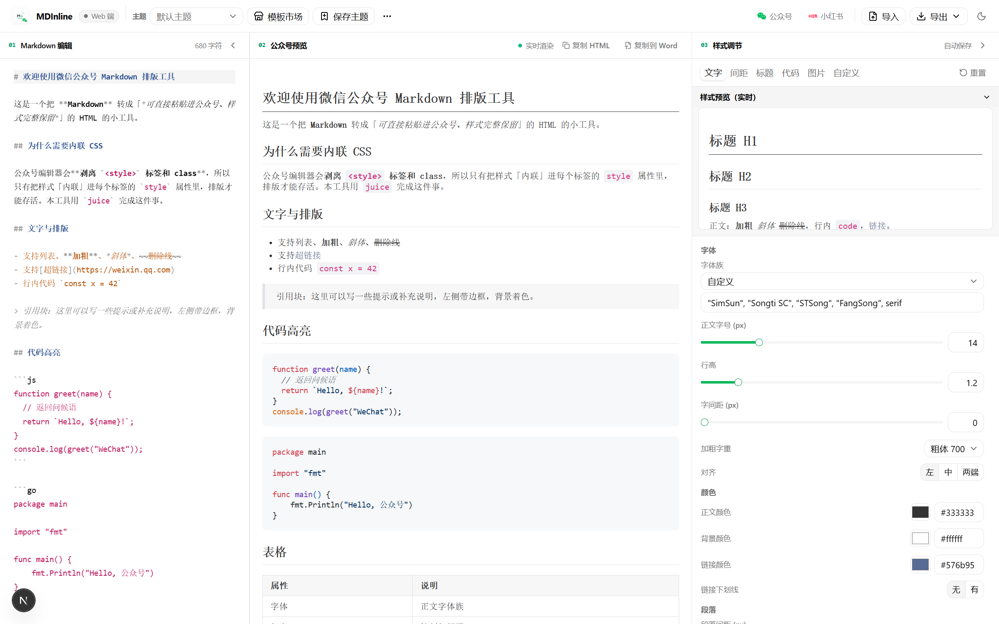
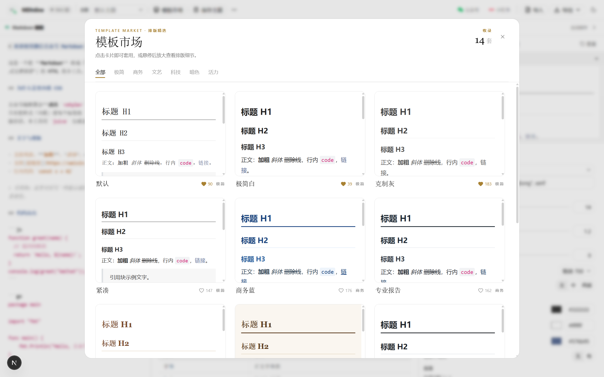

# MDInline

[](./LICENSE)
[](#)
[](#)
[](#)

把 Markdown 转成「**可直接粘贴进微信公众号编辑器、样式 100% 保留**」的 HTML。

左侧编辑 Markdown,中间实时预览(所见即所得),右侧可视化调节字体 / 间距 / 标题 / 代码 / 图片等排版,一键复制进公众号。

**纯前端、纯静态、无后端** —— 所有 Markdown 解析、样式生成、CSS 内联逻辑都在浏览器里完成。



---

## 为什么是「内联 CSS」

公众号图文编辑器会**剥离 `<style>` 标签、`class`、`id` 等属性**,只保留每个元素上的 `style="..."`。

所以本工具的本质流程是:

```
Markdown ──markdown-it──▶ HTML ─┐
                                 ├─▶ juice(内联) ──▶ 每个 <p>/<h1>/<code>… 都带 style=""
ThemeConfig ──generateCSS──▶ CSS ┘
```

预览里渲染的就是**已经内联好样式**的 HTML,和粘贴进公众号后看到的一模一样。

---

## 功能

- 实时编辑 + 实时渲染(防抖 150ms),编辑器自带**字数统计**。
- 可视化样式面板:**文字 / 间距 / 标题 / 代码 / 图片** + **自定义 CSS** 覆盖。
- 代码语法高亮(highlight.js)随主题一起内联,粘贴进公众号仍带配色。
- **模板市场**:14 套精选排版(极简 / 商务 / 文艺 / 科技 / 暗色 / 活力 6 类),卡片预览 + 一键套用。
- **主题库** + **主题导入导出**(`.mdcss-theme.json`):保存当前样式、随时切换,换设备可迁移。
- **复制**:微信 HTML(直接粘进公众号)、Word(RTF,粘进 Word / WPS)。
- **导出** `.html` / `.docx` / `.doc` / `.md`;**导入** `.md` / `.docx` / `.doc` / `.html` / `.txt`。
- 全局快捷键(Ctrl/⌘ + O / S / E / D)。
- **明暗双主题**界面(顶栏一键切换),编辑器与面板都跟随。
- 内容与主题自动保存在本地(localStorage);**纯前端、无后端,内容不上传**。

> 公众号正文宽约 **677px**,预览默认按此宽度渲染,贴近公众号最终效果。

---

## 前置依赖

| 依赖 | 版本 |
|------|------|
| Node.js | ≥ 20 |

---

## 快速开始

```bash
cd frontend
npm install
npm run dev          # 开发: http://localhost:3000
```

构建静态产物并本地预览:

```bash
cd frontend
npm run build        # 产出 frontend/out/
npm run preview      # 用 serve 托管 out/
```

`out/` 是纯静态站点,可部署到任意静态托管(Vercel / GitHub Pages / 对象存储 / Nginx)。

---

## Docker(生产部署)

多阶段构建:`node:20-alpine` 编译静态导出 → `nginx:alpine` 托管。最终镜像约 **~80MB**(nginx 基础镜像 ~45MB + 静态产物 ~35MB,含 docx/mammoth/highlight.js/CodeMirror 等前端依赖),无服务端运行时。

```bash
docker build -t mdinline .
docker run -d -p 8080:80 --name mdinline mdinline   # → http://localhost:8080
```

或用 docker compose:

```bash
docker compose up -d
```

> 站点托管在根路径 `/`。若需部署在子路径,给 `frontend/next.config.ts` 加 `basePath` 后重新构建。

---

## 怎么用

1. 在左侧 **Markdown 编辑** 区写 / 粘贴内容。
2. 中间 **预览** 区实时显示已内联样式的效果。
3. 右侧 **样式调节** 调字体、间距、标题、代码、图片;顶栏「模板市场」一键套用精选排版,或导入 / 导出主题。
4. 顶栏 **复制 HTML** → 到公众号图文编辑器里 `Ctrl+V` 粘贴。
5. 需要 standalone 文件:顶栏 **导出**(HTML / Word / Markdown)。

> **关于图片**:粘贴进公众号时,**本地路径的图片不会上传保留**。请使用可公网访问的图片地址(或先用公众号图床上传拿到链接)。这是公众号的限制,与本工具无关。

---

## 模板市场

顶栏「模板市场」打开一个排版精选库,内置 **14 套**模板,按 6 个分类组织:

| 分类 | 模板 |
| --- | --- |
| 极简 | 默认 · 极简白 · 克制灰 · 紧凑 |
| 商务 | 商务蓝 · 专业报告 |
| 文艺 | 雅致衬线 · 古典书卷 |
| 科技 | 代码风 · 极客绿 |
| 暗色 | 暗夜 · 墨黑 |
| 活力 | 活力橙 · 薄荷绿 |



每张卡片用真实样式标本预览(标题 / 正文 / 引用 / 代码 / 表格 / 图片),分类 tab 筛选,「套用此模板」一键应用到当前正文,或悬停「放大」查看排版细节。模板只动公众号安全属性,套用后走的是同一条内联流水线,粘贴效果与手调样式一致。

---

## 快捷键

| 快捷键 | 动作 |
| --- | --- |
| `Ctrl/⌘ + O` | 导入(Markdown / Word / HTML) |
| `Ctrl/⌘ + S` | 导出 Markdown(`.md`) |
| `Ctrl/⌘ + E` | 导出 HTML(`.html`) |
| `Ctrl/⌘ + D` | 导出 Word(`.docx`) |

> 复制(微信 / Word)、导出 `.doc`、主题切换、样式调节等其余操作走顶栏按钮(未绑快捷键)。

---

## Markdown 语法支持

基于 markdown-it(`html: false` + `linkify`)+ highlight.js 语法高亮:

- **支持**:标题、**加粗**、*斜体*、~~删除线~~、[链接](https://weixin.qq.com)、图片、有序 / 无序列表、行内与围栏代码、引用、分隔线、表格、链接自动识别。
- **代码高亮**:围栏代码块用 ` ```js ` / ` ```go ` 指定语言,或不写让其自动识别(支持语言见 [highlight.js demo](https://highlightjs.org/static/demo/))。
- **不支持**:任务列表(`- [x]`)、脚注、数学公式、流程图等(`lib/md.ts` 未加载相关插件,如需可自行扩展)。
- **安全**:Markdown 里的**原始 HTML 会被转义**(`html: false`),不能内嵌 `<script>` 或任意标签。

---

## 主题插件格式

主题即一份 `ThemeConfig` 的 JSON,导出后缀 `.mdcss-theme.json`,结构对应 `frontend/src/lib/theme.ts`:

```jsonc
{
  "meta": { "name": "我的主题", "version": "1" },
  "base":     { "fontFamily": "...", "fontSize": 15, "fontColor": "#333", ... },
  "headings": { "h1": { "fontSize": 24, "color": "#000", ... }, ... },
  "spacing":  { ... },
  "code":     { "hlTheme": "github", "highlight": true, ... },
  "image":    { ... },
  "link":     { "color": "#576b95", ... },
  "customCss": "/* 追加在生成 CSS 末尾,优先级最高 */"
}
```

导入后样式会复现,并加入本地主题库可随时切换。换设备 / 重装后导入同一份 `.mdcss-theme.json` 即可还原。

---

## 目录结构

```
MDInline/
├── README.md
├── LICENSE
├── .nvmrc
├── .gitignore / .dockerignore
├── docs/                    # README 用截图(interface.png / template-market.png)
├── Dockerfile               # 多阶段:node 构建 → nginx 托管
├── nginx.conf               # gzip + 长缓存 + SPA 兜底
├── docker-compose.yml
└── frontend/                # Next.js 前端(静态导出)
    ├── package.json         # dev / build / preview
    ├── next.config.ts       # output:'export', images.unoptimized
    ├── scripts/build.mjs    # 生产构建(保留 --webpack)
    └── src/
        ├── app/             # layout / page / globals.css
        ├── components/      # Editor / Preview / StylePanel / ThemeBar / Toolbar / …
        ├── hooks/           # useDebounced / useDocActions / useHotkey / useMediaQuery / usePaneLayout
        ├── lib/             # md / theme / css / inline / pipeline / hlThemes / themeStore
        │                    #   + word/(docx/rtf 导出) + import/(docx 导入) + templates / likes
        └── native/          # 运行时检测,本仓库为纯 Web 实现
```

### 公众号安全属性守卫

`generateCSS(theme)` 只使用公众号**不会剥离**的属性:`font-* / color / background / border / border-radius / margin / padding / text-align / line-height / letter-spacing` 等。避免使用会被过滤的 `position / float / flex / grid` 等(自定义 CSS 区可自行尝试,但需以公众号实际渲染为准)。

---

## 技术栈

Next.js 16(静态导出)、React 19、TypeScript、Tailwind v4、shadcn(radix)、markdown-it、highlight.js、juice、CodeMirror 6。

---

## 常见问题

**图片粘贴进公众号后丢失了?**
公众号不会自动上传本地路径或外链图片。请使用可在公网访问的图片地址(或先在公众号图床上传拿到链接)。这是公众号的限制,与本工具无关。

**我的内容 / 主题会被上传到服务器吗?**
不会。本工具**纯前端、无后端**,所有 Markdown 解析、样式生成、CSS 内联都在你的浏览器本地完成,不把内容发送到任何外部服务器(加载页面本身只请求静态资源)。

**设置存在哪?换电脑怎么办?**
正文与主题保存在浏览器 `localStorage`(`mdcss.*` 键)。清浏览器数据会丢失,建议用顶栏「导出 Markdown」+「导出主题」备份;在新设备「导入」即可还原。

**复制后粘贴样式丢失了?**
粘贴目标需支持 `text/html`——公众号图文、Word、WPS、富文本编辑器都支持;粘贴到纯文本框(记事本、代码编辑器)只会得到纯文本。

**支持哪些导入格式?**
`.md` / `.markdown` / `.txt`(按 Markdown 解析)、`.html` / `.htm`(HTML → Markdown)、`.docx`(mammoth 解析)、`.doc`(OLE 二进制或 Word-HTML,尽力提取为文本)。

**有桌面版吗?**
本仓库是 Web 端,纯静态部署即可在线使用。桌面版(Windows 原生窗口,Wails)是独立项目。

---

## 许可

[MIT](./LICENSE) © 2026 din4e
